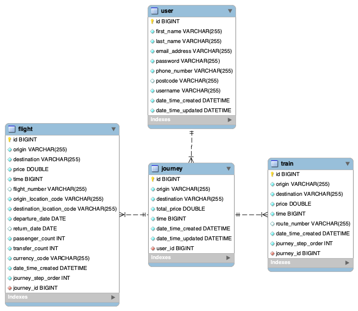

# getyourway

## First time setup

1. ensure mysql server is running.
2. run the commands within src/main/resources/db/schema.sql inside your local mysql database.
   > mysql -u root < src/main/resources/db/schema.sql
3. install the maven dependencies for the spring-boot project
   > mvn install
4. install the npm dependencies for the frontend
   > cd frontend/ && npm install && cd ..

### To start the server (also creates the DB tables)

> mvn spring-boot:run

### To start the frontend

run this in a new terminal instance - it will start the UI on localhost:3000
> cd frontend/ && npm start

## Documentation

The current MySQL db schema:

Things worth noting regarding the schema:

- A user can have zero to many journeys. A journey is composed of zero to many flights and trains (both of which inherit
  properties of Transport). The relationship is controlled through foreign keys and joins.
- The `time` column currently has the duration of the flight/train journey leg in seconds. React converts this to hours
  and minutes for display purposes.
- While the database tables for train exist, only flight endpoints have been implemented.
- `journey_step_order`: is the position of the particular flight or train in relation to the journey instance.
  Currently,
  this is hardcoded to 1 within the 'FlightServiceImpl.save(flightDTO)' method.
    - The idea of journey_step_order is to give you the sequential order of the legs of the journey (be it a train or
      flight).
      So say we have a 3 leg journey from LHR to IST (London to Istanbul):
        - Flight from LHR to GLA
        - Train from GLA to EDI
        - Flight from EDI to IST
    - In the database we would have:
        - 1 row in the journey table origin LHR, Dest IST.
        - 2 rows in the flight table that link to the above journey row.
            - flight row 1: {origin:LHR,dest:GLA,journey_step_order:1,journey_id:1}
            - flight row 2: {origin:EDI,dest:IST,journey_step_order:3,journey_id:1}
        - 1 row in the train table
            - train row: {origin:GLA,dest:EDI,journey_step_order:2,journey_id:1}
- `transfer_count`: when it is one it means it is a direct flight, more than one means there are `transfer_count - 1`
  connections.

The `liquibase` plugin is used to create the database tables for us and keep track of any manual changes done to the
database. Aka
it's a version control for the database itself.

Steps to change the schema:

- make the change in your local MySQL db instance then run
  > mvn liquibase:diff
- this will add the change commands within src/main/resources/db/changelog. Commit this file so that other devs will
  automatically get your db schema changes on the next pull and rerun.

### Backend config

The backend Spring config is located within src/main/resources/

- application.properties states which config files (based on profile name) to use. To run locally it would be: common,
  local
- application-common.yml contains the defaults
- Example: You want to change the local-profile backend logging level to DEBUG:
  - Within application-local.properties add this line then restart the springboot server:
  > logging.level.org.springframework.web=DEBUG

### Frontend notes

- client.ts defines the links to the controller endpoints on the backend.
- Not added postcode as part of the register form, but it is defined in the db schema/backend.
- `currencyCode` was added as part of the search as Amadeus flight API returns the flight costs in the airline’s
  currency -
  this ensures it's converted to GBP (default) or the desired currency.