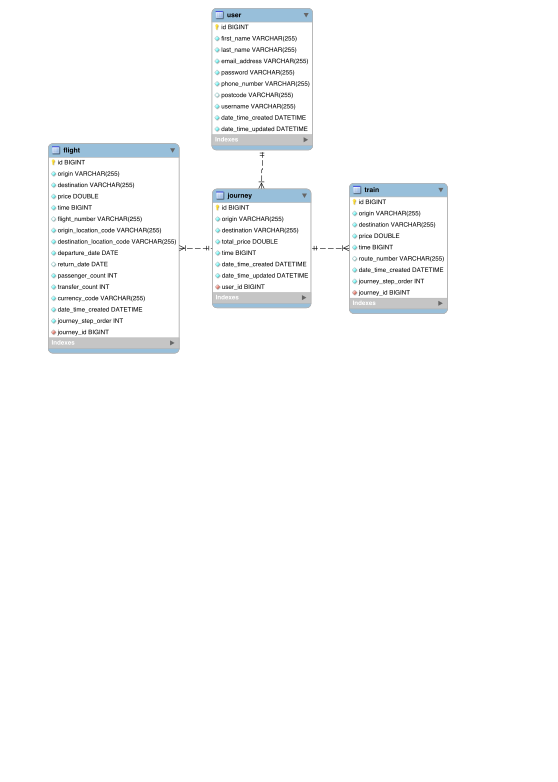

# getyourway

## First time setup
1. ensure mysql server is running.
2. run the commands within resources/db/schema.sql inside your local mysql database.
3. > mvn install
4. > cd  frontend/ &&  npm install  --legacy-peer-deps

### To start server (also creates the DB tables)
> mvn spring-boot:run

### To start frontend on localhost:3000
>cd frontend/ && npm start

## docs
The current db schema:

